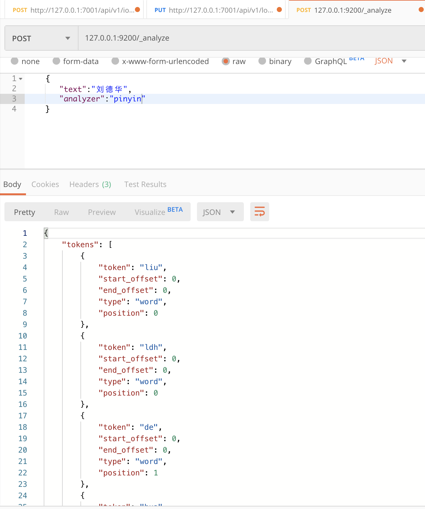

A Repository with plugins ik and pinyin

### analysis-smartcn

https://artifacts.elastic.co/downloads/elasticsearch-plugins/analysis-smartcn/analysis-smartcn-7.6.1.zip

### ik 分词示例


### pinyin



## Docker Image

- elasticsearch-ik-pinyin


## 7.6.1

`elasticsearch` With plugins `elasticsearch-analysis-pinyin` and `elasticsearch-analysis-ik`

```shell
docker build . -t elasticsearch-plugins
```

## QuickStart

### Running in Development Mode

Create user defined network (useful for connecting to other services attached to the same network (e.g. Kibana)):
```shell
docker network create somenetwork
```

Run Elasticsearch:
```shell
docker run -d --name elasticsearch --net somenetwork -p 9200:9200 -p 9300:9300 -e "discovery.type=single-node" elasticsearch-ik-pinyin
```

### Running in Production Mode

See [Install Elasticsearch with Docker](https://www.elastic.co/guide/en/elasticsearch/reference/7.5/docker.html)

## 参考

- 社区贡献的API扩展插件 https://www.elastic.co/guide/en/elasticsearch/plugins/current/api.html#api